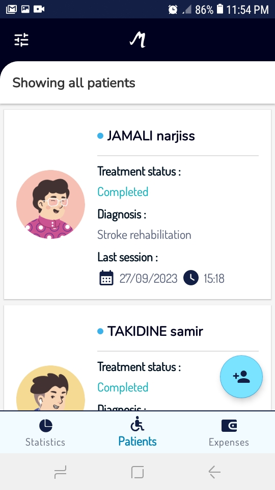
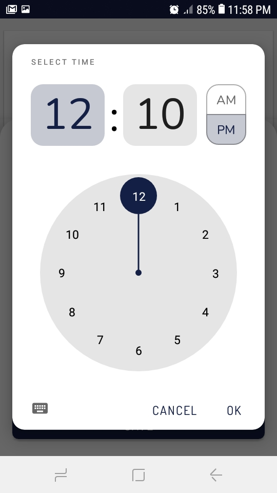

# Manage your small clinic - Medicalog

## Description:

Medicalog is an android application that empowers small clinic owners to take control of their finances and streamline patient management.
The main features of the app are the following:

### Simplifying Clinic Management: 

This project is all about simplifying the daily tasks of small clinic owners. It's an example of what can be done to streamline financial management, patient records, and billing processes.

### Financial Insight: 

Explore how expenses and income tracking are implemented. Get a glimpse of how the app provides clinic owners with valuable financial insights.

### Efficient Patient Management: 

Dive into the patient management features, including the ability to search and filter patient records.

### Billing Made Easy:

Take a look at how I've designed a seamless billing system, allowing you to generate patient invoices and quotations effortlessly.

### Comprehensive Record-Keeping:

Explore the functionality for recording patient sessions, complete with time and date stamps.

## Key Technologies:
  
It leverages the following components from the Jetpack library:

* [ViewModel](https://developer.android.com/topic/libraries/architecture/viewmodel)
* [LiveData](https://developer.android.com/topic/libraries/architecture/livedata)
* [Data Binding](https://developer.android.com/topic/libraries/data-binding/) with binding adapters
* [Navigation](https://developer.android.com/topic/libraries/architecture/navigation/) with the SafeArgs plugin for parameter passing between fragments
* [Room](https://developer.android.com/training/data-storage/room/) for data persisting
* [Paging library](https://developer.android.com/topic/libraries/architecture/paging/v3-overview) for infinite list scrolling

Architecture:

* [UI layer](https://developer.android.com/topic/architecture/ui-layer) the pipeline between application data and the UI
* [Data layer](https://developer.android.com/topic/architecture/data-layer) containing application data and business logic
* [Domain layer](https://developer.android.com/topic/architecture/domain-layer)

Libraries:

* [MPAndroidChart](https://github.com/PhilJay/MPAndroidChart) a powerful Android chart view / graph view library
* [Lottie](https://github.com/airbnb/lottie-android) for rendering After Effects animations
* [ICU4J](https://unicode-org.github.io/icu/userguide/icu4j/) to convert numbers to their corresponding words
* [iTextPdf](https://itextpdf.com/) to manipulate pdf documents
* [Material Design 2](https://m2.material.io/develop/android)

Including:

* kotlin Coroutines and Flow for asynchronous operations

## Screenshots

## Languages supported:

English, French.

## Conclusion:

Feel free to explore the code, play around with the features, and use this project as a reference for your own work. This is my contribution to the developer community, and I hope it inspires and helps others in their own projects and endeavors.

## Report Issues
Notice any issues with the repository? Please file a github issue in the repository.
